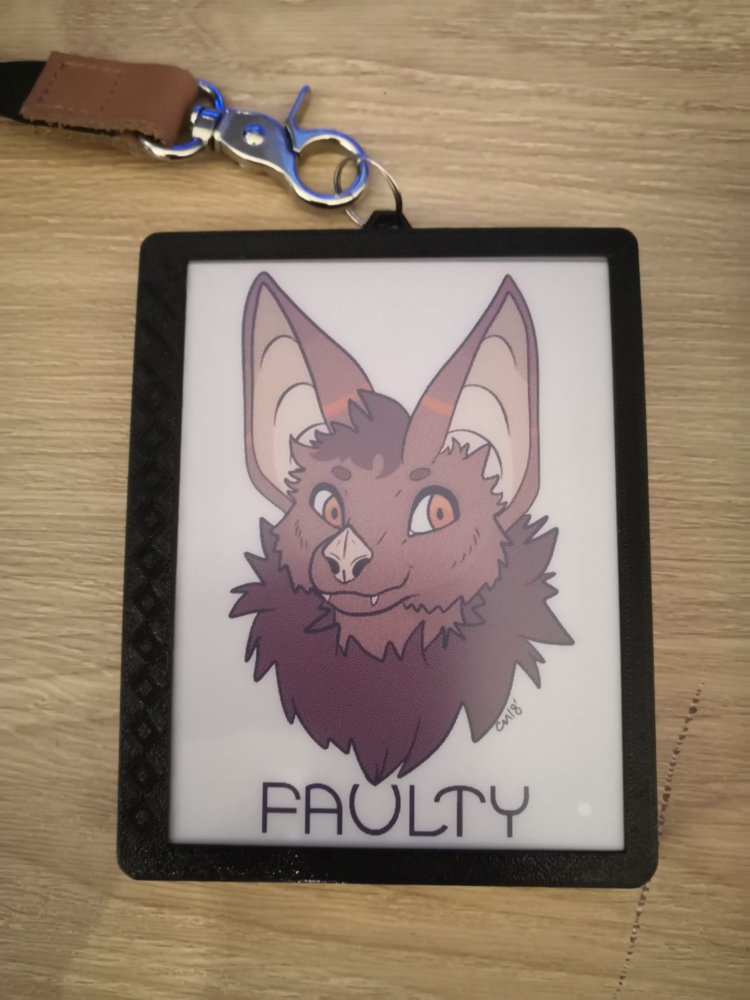

# E-ink fur-con badge

this is a very *very* early prototype of a convention badge that uses a 7 color e-ink display (the [5.65inch ACeP 7-Color E-Paper E-Ink Display Module](https://www.waveshare.com/5.65inch-e-paper-module-f.htm)) to render images.

This demo is written for the raspberry Pi pico, and it is currently only a proof of concept and the code is in a **very** unmaintainable state and can't be compiled as is. However i intend to fully re-write most of the code for the Arduino platform using a EPS32.

I also plan to rebuild the case for the badge making it thinner and lighter, as well as modify it to use a two hook lanyard instead of a single hook one (or at least design for both in mind)

The screen only uses 7 colors however by utilizing  dithering (Floyd–Steinberg dithering to be precises) you can fake a larger color pallet. an example of this can be seen here :bat: : 

## Quick reference martial
Primarily just here so i can quickly reference it later on without needing to look though my code or (none existent) schematics. 
### Used pins

SD_CARD (on SPI 0)

- sck = 18
- mosi = 19
- miso = 16
- CS = 5

Eink (on SPI 1)

- DIN = 11
- clk = 10
- CS = 9
- DC = 8
- RST = 12
- Busy = 13
